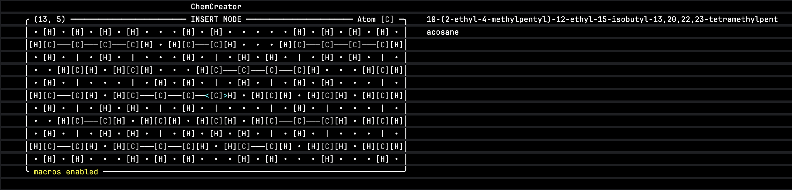

<h1>ChemCreator</h1>

</img>

</img>
</img>

A text-based tool for identifying organic molecules.

Written in Rust with the [`ruscii`](https://github.com/lemunozm/ruscii) library.

## Preface

ChemCreator is a program you can open in your terminal to generate the name of
an organic molecule. You recreate the structure in a grid, manually inputting
atoms and bonds by using your keyboard. When a valid molecule is found,
ChemCreator will try its best to give you the molecule's IUPAC systematic name.

ChemCreator is a personal project that I started to explore the Rust programming
language and also try out a moderately difficult problem in traversing a grid to
find certain structures, determine patterns, etc.

It's not perfect; it may get a few names wrong here and there at times, so if
you try it out and find something named incorrectly, please open an issue!

## Features

- Parent chain highlighting
- Molecule statistics
- Macros

### Supported Molecule Structures

- [x] Alkanes, Alkenes and Alkynes
- [x] Alcohols
- [x] Aldehydes and Ketones
- [x] Amides
- [x] Amines
- [x] Carboxylic acids
- [ ] Esters
- [ ] Ethers
- [x] Halogenoalkanes
- [x] Nitriles
- [x] Side chains

## Usage

### Insert Mode

In insert mode, you can edit the grid to create a molecule. If the structure is valid and ChemCreator recognizes it,
it'll give you a name for it.

> ⓘ  These screenshots were taken from CLion's inbuilt terminal, but you could just as easily use a terminal of your 
> choice.

### Display Mode

In display mode, a clean picture is shown of your molecule as well as some basic statistics including atom count, atomic
weight, index of hydrogen deficiency (IHD), and the length of the name in characters.

### Macros

You can toggle macro mode with the F7 key. With macros, building common structures can be done in fewer keystrokes.

### Errors

ChemCreator, using Rust's brilliant error handling system, can tell you precisely where an invalid structure exists in
the graph.

### Parent Chain Highlighting

The parent chain of a complicated molecule can sometimes be difficult to determine, especially when multiple chains
contain functional groups.

For example, where is the parent chain here?

You don't have to guess! By pressing the 0 key, ChemCreator will instantly show you.

